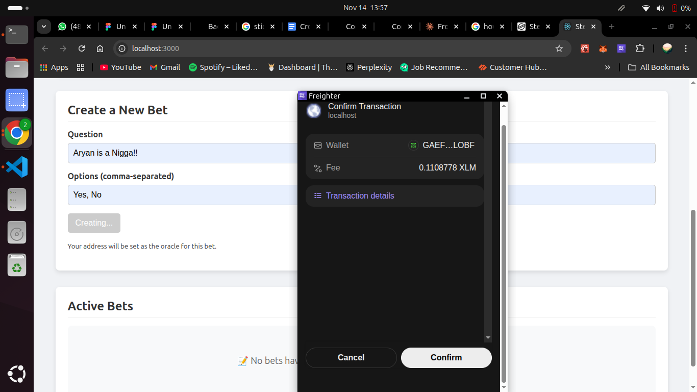
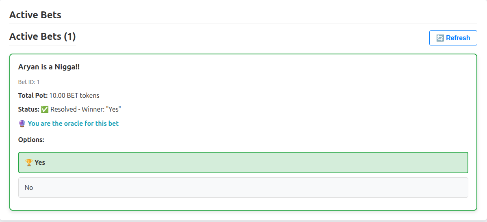
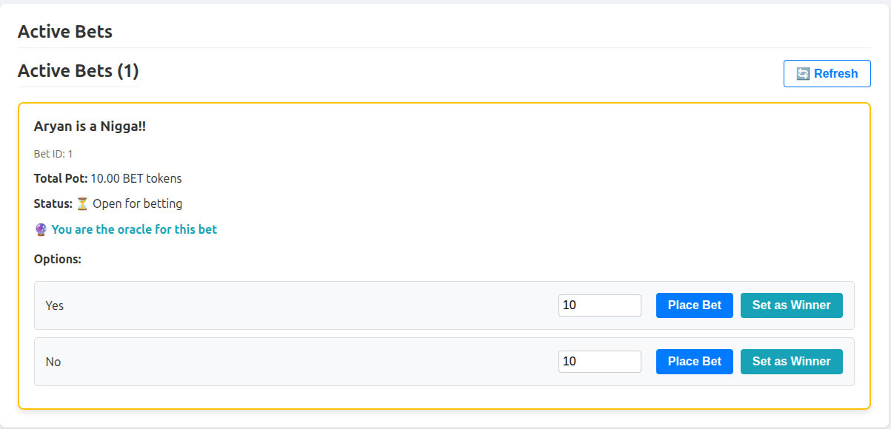

# 🎲 Stellar Betting DApp

A decentralized prediction market built on the Stellar blockchain using Soroban smart contracts. Create bets, place wagers, and claim winnings in a trustless, transparent environment.





## 🌟 Features

- **Create Prediction Markets**: Anyone can create a bet with custom questions and options
- **Place Bets**: Wager BET tokens on your prediction
- **Oracle Resolution**: Designated oracles resolve bets when outcomes are determined
- **Claim Winnings**: Winners automatically receive their proportional share of the pot
- **Transparent & Trustless**: All logic executed on-chain via Soroban smart contracts

## 🔗 Deployed Contract Information

### Testnet Deployment

- **Contract Address**: `CBJSXYQFHOVA7VKOJHDDY4ZIVE7JHBUVFXLLEYM4RL35VCHUYTNG662J`
- **Token Address (BET)**: `CBCNUB3UJP2WEDD5JI474B3POLTAF2GMKYCRGQ4RWOGWX5SNN5RZDQVS`
- **Token Issuer**: `GB5WKIXJPDBZ36X4X7OGKLEOXBKP7APWHIQQ4ZHE5GGZ47JQXGAKP72R`
- **Network**: Stellar Testnet
- **Wasm Hash**: `9d57de310599719862a25244cb998cccc442653c7a83df6d615b907751f40fea`

### Explorer Links

- **Contract**: [View on Stellar Expert](https://stellar.expert/explorer/testnet/contract/CBJSXYQFHOVA7VKOJHDDY4ZIVE7JHBUVFXLLEYM4RL35VCHUYTNG662J)
- **Deploy Transaction**: [View on Stellar Expert](https://stellar.expert/explorer/testnet/tx/cdbb9189803c3e6ce4e42afe43bd456d63179a3a21311398fead43cf003854b8)

## 📋 Prerequisites

- [Node.js](https://nodejs.org/) (v16 or higher)
- [Rust](https://www.rust-lang.org/tools/install) (for contract development)
- [Stellar CLI](https://developers.stellar.org/docs/tools/developer-tools#stellar-cli)
- [Freighter Wallet](https://www.freighter.app/) browser extension

## 🚀 Quick Start

### 1. Clone the Repository

```bash
git clone https://github.com/nikhil-r0/stellar-bet
cd stellar-bet
```

### 2. Backend Setup (Optional - Already Deployed)

The smart contract is already deployed to testnet. If you want to deploy your own:

```bash
cd backend

# Build the contract
stellar contract build

# Deploy to testnet
stellar contract deploy \
  --wasm target/wasm32v1-none/release/soroban_betting_contract.wasm \
  --source-account <your-account> \
  --network testnet

# Initialize the contract
stellar contract invoke \
  --id <CONTRACT_ID> \
  --source-account <your-account> \
  --network testnet \
  -- initialize
```

### 3. Frontend Setup

```bash
cd frontend

# Install dependencies
npm install

# Create .env file
cp .env.example .env

# Update .env with your values (or use the defaults for testnet)
# REACT_APP_CONTRACT_ID=CBJSXYQFHOVA7VKOJHDDY4ZIVE7JHBUVFXLLEYM4RL35VCHUYTNG662J
# REACT_APP_TOKEN_ID=CBCNUB3UJP2WEDD5JI474B3POLTAF2GMKYCRGQ4RWOGWX5SNN5RZDQVS
# REACT_APP_RPC_URL=https://soroban-testnet.stellar.org
# REACT_APP_NETWORK=Test SDF Network ; September 2015

# Start the development server
npm start
```

The app will open at `http://localhost:3000`

### 4. Setup Freighter Wallet

1. Install [Freighter Wallet](https://www.freighter.app/) extension
2. Create a new wallet or import an existing one
3. Make sure you're on **Testnet** network in Freighter settings

### 5. Fund Your Account

```bash
# Fund via Friendbot
curl "https://friendbot.stellar.org/?addr=<YOUR_ADDRESS>"

# Or use Stellar CLI
stellar keys fund <your-key-name> --network testnet
```

### 6. Get BET Tokens

#### Step 1: Trust the BET token
```bash
stellar tx new change-trust \
  --source-account <your-account> \
  --line "BET:GB5WKIXJPDBZ36X4X7OGKLEOXBKP7APWHIQQ4ZHE5GGZ47JQXGAKP72R" \
  --network testnet
```

#### Step 2: Request tokens
Contact the token issuer or use a funded account to send you tokens:
```bash
stellar tx new payment \
  --source-account <issuer-account> \
  --destination <YOUR_ADDRESS> \
  --amount 1000 \
  --asset "BET:GB5WKIXJPDBZ36X4X7OGKLEOXBKP7APWHIQQ4ZHE5GGZ47JQXGAKP72R" \
  --network testnet
```

## 🎮 How to Use

### Creating a Bet

1. Connect your Freighter wallet
2. Fill in the bet question (e.g., "Who will win the 2025 NBA Finals?")
3. Add options separated by commas (e.g., "Lakers, Celtics, Warriors")
4. Click "Create Bet"
5. Confirm the transaction in Freighter
6. Your address becomes the oracle for this bet

### Placing a Bet

1. Browse available bets
2. Choose an option you want to bet on
3. Enter the amount of BET tokens to wager
4. Click "Place Bet"
5. Confirm the transaction in Freighter

### Resolving a Bet (Oracle Only)

1. Only the oracle (bet creator) can resolve
2. Once the outcome is known, click "Set as Winner" on the correct option
3. Confirm the transaction
4. The bet is now resolved

### Claiming Winnings

1. After a bet is resolved, if you bet on the winning option, click "Claim Winnings"
2. Confirm the transaction
3. You'll receive your proportional share of the total pot

## 🏗️ Project Structure

```
stellar-betting-dapp/
├── backend/                    # Soroban smart contract
│   ├── src/
│   │   └── lib.rs             # Contract logic
│   ├── Cargo.toml
│   └── Cargo.lock
│
├── frontend/                   # React TypeScript frontend
│   ├── src/
│   │   ├── components/
│   │   │   ├── BetCard.tsx        # Individual bet display
│   │   │   ├── BetList.tsx        # List of all bets
│   │   │   ├── ConnectWallet.tsx  # Wallet connection
│   │   │   └── CreateBetForm.tsx  # Bet creation form
│   │   ├── utils/
│   │   │   └── soroban.ts         # Contract interaction logic
│   │   ├── App.tsx
│   │   └── index.tsx
│   ├── .env.example
│   ├── package.json
│   └── tsconfig.json
│
└── README.md
```

## 🔧 Smart Contract Functions

### Write Functions

- **`initialize()`**: Initialize the contract (one-time)
- **`create_bet(oracle, question, options)`**: Create a new bet
- **`place_bet(bettor, bet_id, option_index, amount, token_address)`**: Place a bet on an option
- **`resolve_bet(oracle, bet_id, winning_option_index)`**: Resolve a bet (oracle only)
- **`claim_winnings(claimer, bet_id, token_address)`**: Claim winnings after resolution

### Read Functions

- **`get_bet(bet_id)`**: Get details of a specific bet
- **`get_bets_count()`**: Get total number of bets created

## 💡 Key Features Explained

### Token Economics

- All bets are made using BET tokens (custom Stellar asset)
- 1 BET token = 10,000,000 stroops (7 decimal places)
- Winners receive proportional shares based on their stake

### Oracle System

- The bet creator becomes the oracle
- Only the oracle can resolve the bet
- Oracle should resolve honestly (reputation at stake)

### Pot Distribution

```
Winner's Payout = (Winner's Stake / Total Winning Stakes) × Total Pot
```

Example:
- Total pot: 1000 BET
- Alice bet 300 BET on option A
- Bob bet 200 BET on option A
- Option A wins
- Alice receives: (300/500) × 1000 = 600 BET
- Bob receives: (200/500) × 1000 = 400 BET

## 🛠️ Development

### Build Contract

```bash
cd backend
stellar contract build
```

### Test Contract Locally

```bash
cargo test
```

### Deploy New Contract

```bash
# Upload wasm
stellar contract upload \
  --wasm target/wasm32v1-none/release/soroban_betting_contract.wasm \
  --source-account <your-account> \
  --network testnet

# Deploy contract
stellar contract deploy \
  --wasm-hash <WASM_HASH> \
  --source-account <your-account> \
  --network testnet
```

### Frontend Development

```bash
cd frontend
npm start          # Start dev server
npm run build      # Build for production
npm test           # Run tests
```

## 🔒 Security Considerations

- ⚠️ This is a testnet deployment - DO NOT use on mainnet without proper audits
- Smart contracts are immutable once deployed
- Always verify contract addresses before interacting
- Keep your Freighter wallet secure
- Oracle centralization is a trust assumption

## 🐛 Troubleshooting

### "Account not found" Error
Your account needs to be funded on testnet:
```bash
curl "https://friendbot.stellar.org/?addr=<YOUR_ADDRESS>"
```

### "Failed to place bet"
- Ensure you have enough BET tokens
- Check that you haven't already placed a bet on this question
- Verify the bet isn't already resolved

### Contract Interaction Issues
- Confirm your `.env` file has the correct values
- Make sure you're on testnet in Freighter
- Check that you have enough XLM for transaction fees (~0.1 XLM)

### RPC Errors
- Restart your development server after changing `.env`
- Verify RPC URL is correct: `https://soroban-testnet.stellar.org`

## 📚 Resources

- [Stellar Documentation](https://developers.stellar.org/)
- [Soroban Documentation](https://soroban.stellar.org/docs)
- [Stellar SDK](https://github.com/stellar/js-stellar-sdk)
- [Freighter Wallet](https://www.freighter.app/)

## 🤝 Contributing

Contributions are welcome! Please feel free to submit a Pull Request.

1. Fork the repository
2. Create your feature branch (`git checkout -b feature/AmazingFeature`)
3. Commit your changes (`git commit -m 'Add some AmazingFeature'`)
4. Push to the branch (`git push origin feature/AmazingFeature`)
5. Open a Pull Request

## 📄 License

This project is open source and available under the [MIT License](LICENSE).

## 👥 Authors

- Nikhil R - Initial work

## 🙏 Acknowledgments

- Stellar Development Foundation for Soroban
- Freighter team for the excellent wallet
- The Stellar community

---

**⚠️ Disclaimer**: This is a demonstration project deployed on testnet. Do not use real funds or deploy to mainnet without proper security audits and testing.